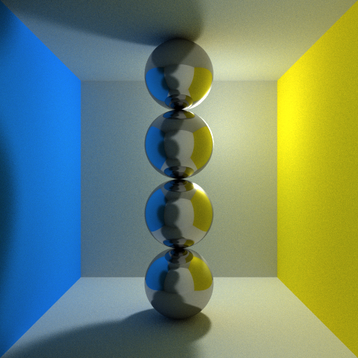

## PATH TRACING IN WEBGL

#### Hongyu Jiang (19T9801)

12, Nov, 2020

#### Brief introduction

Refered program: [WebGL Path Tracing](https://github.com/evanw/webgl-path-tracing)

> As shown in above link, the program only contains the tracing rules for total reflection and diffuse reflection and didn't support glass-like material rendering. For the translucent object, the light ray will go through the hited object and refracted in the interface. Therefore, we add refraction rule in this program for glass-like objects rendering.

> When a light ray shoot in or shoot out a object, the ray may go through it and refract in the interface, also it may be reflected in the interface. By generating rays with monte carol method, the hieted ray may bounced in the hited object and cost more computational resource. Therefore, to simplify the problem, for each of the hited ray, the final color will calculated by two tracing process. One is conducted for total reflection while the other is for total refraction. In the end, the returned color of this ray is the weighted sum of the two calculation results.


* The main concept of this idea


#### Main modification introduction

Some main modification for tracing with both refraction and reflection are described following

1. Main function

```GLSL
void main() {
  vec3 newLight = light + uniformlyRandomVector(timeSinceStart - 53.0) *  lightSize;
  vec3 texture = texture2D(texture, gl_FragCoord.xy / 512.0).rgb;

  // each ray will be calculated twice
  for (int i = 1; i < 3; i++) {
    vec4 temp_color = vec4(mix(calculateColor(eye, initialRay, newLight, i), texture, textureWeight), 1.0);
    gl_FragColor += temp_color;
  }
  gl_FragColor /= 2.0;
}
```

2. Addition for refraction computing in tracing loop

```GLSL

//to compute direction of refracted ray
vec3 inRay = refract(ray, normal, 1.3);

//to get the farther one of intersect points between ray and sphere
float farPointT = intersectSphere(hit, inRay, hitCenter, hitRadius);
vec3 farPoint = hit + inRay * farPointT;

//compute the refract normal of farther point
vec3 farPointNormal = normalForSphere(farPoint, inRay, hitCenter, hitRadius);

//compute direction of the ray out of the sphere
vec3 outRay = refract(inRay, farPointNormal, 1.3);
specularHighlight = 0.3;
specularHighlight = 2.0 * pow(specularHighlight, 3.0);

//set for next bounce
ray = outRay;
hit = farPoint;
```

3. IntersectSphere

> There are two points intersected with one hited ray, which is not tangent to a sphere. Here, we add a judge process in this function for decide which point shoule be return. If the ray origin is in the surface of this sphere, this function will return the futher point, otherwise is the near point. Also, if there is no intersection, this function will returns a value of infinity.

```GLSL
float intersectSphere(vec3 origin, vec3 ray, vec3 sphereCenter, float sphereRadius) {

    bool isInSurface = false;
    vec3 toSphere = origin - sphereCenter;
    float dis = distance(origin, sphereCenter);

    if (-0.001 + sphereRadius < dis && dis < sphereRadius + 0.001)'
        isInSurface = true;'
        float a = dot(ray, ray);
        float b = 2.0 * dot(toSphere, ray);
        float c = dot(toSphere, toSphere) - sphereRadius * sphereRadius;' +
        float discriminant = b*b - 4.0*a*c;
    if(discriminant > -0.001) {

        // the two solutions for the formula
        float t1 = (-b - sqrt(discriminant)) / (2.0 * a);
        float t2 = (-b + sqrt(discriminant)) / (2.0 * a);

    // If ray origin not in the surface, return the near point 
    if(t1 > 0.0 && !isInSurface) return t1;

    // If ray origin in the surface, return the farther point
    if(t2 > 0.0 && isInSurface) return t2;
    }

    // If there is no solution, return infinity
    else if(discriminant < 0.0001 && discriminant > -0.0001) {
        float t = (-b) / (2.0 * a);
        if(t > 0.0) return t;
    }
        return infinity;
    }
```

1. NormalForSphere

> The origin program didn't consider the situation of refraction. The normal vector is perpendicular to the tangent plane and point to the sphere's outside. But for the refraction situation, the normal vector is point to the innner of the sphere. Therefore, we add a judge action to distinguish the two conditions, that is, if the angle between ray and normal is beyond 90 degree, the real normal's direction should be the opposite direction of the pervious result.

```GLSL
// given that hit is a point on the sphere, what is the surface normal?
vec3 normalForSphere(vec3 hit, vec3 ray, vec3 sphereCenter, float sphereRadius) {
   vec3 _normal = (hit - sphereCenter) / sphereRadius;
   if (dot(_normal, ray) < 0.0)
     return -_normal;
   else return _normal;
 }
```

#### Result Comparsison - 団子

<center class="half">
 
</center>

* Comparison for the tango scene

#### Result Comparsison - Pyramid

<center class="half">
 
</center>

* Comparison for the pyramid scene
